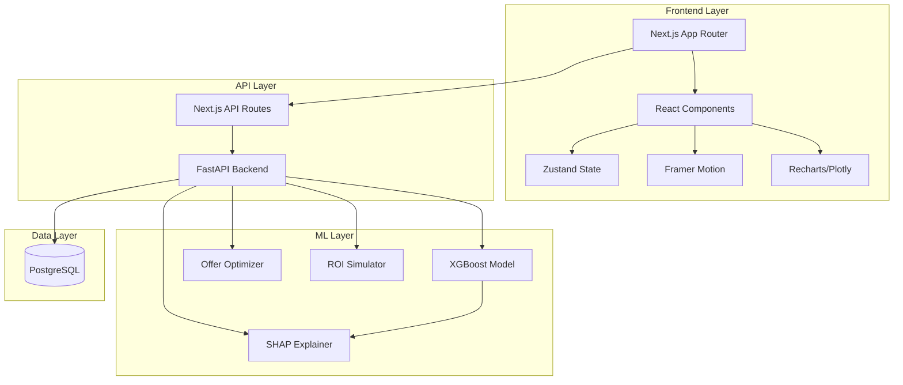

# Design Document: AURA Customer Churn Prevention System

## Overview

The AURA Customer Churn Prevention System is a full-stack web application that combines modern frontend technologies with machine learning capabilities to predict and prevent customer churn in the telecom industry. The system architecture follows a clear separation between presentation (Next.js frontend), business logic (FastAPI backend), and data persistence (PostgreSQL), with ML models served as microservices.

### Architecture Principles

- **Separation of Concerns**: Frontend handles presentation and user interaction, backend manages ML inference and business logic, database stores persistent data
- **API-First Design**: All frontend-backend communication occurs through well-defined REST API endpoints
- **Real-time Responsiveness**: Predictions and calculations update dynamically as users interact with the interface
- **Scalability**: Stateless backend services enable horizontal scaling for increased load
- **Observability**: Comprehensive logging and error tracking throughout the stack

## Architecture

### System Architecture Diagram



### Technology Stack

**Frontend**:
- Next.js 14+ with App Router for SSR and routing
- TypeScript for type safety
- Tailwind CSS for utility-first styling
- Framer Motion for declarative animations
- Recharts or Plotly.js for data visualization
- shadcn/ui for accessible component primitives
- Zustand for lightweight state management

**Backend**:
- FastAPI for high-performance async API serving
- Pydantic for request/response validation
- XGBoost for gradient boosting classification
- SHAP for model explainability
- scikit-learn for data preprocessing
- SQLAlchemy for database ORM
- PostgreSQL for relational data storage

**Deployment**:
- Frontend: Vercel (optimized for Next.js)
- Backend: Railway or Render (containerized FastAPI)
- Database: Managed PostgreSQL (Supabase or Railway)

## Components and Interfaces

### Frontend Components

#### 1. HomePage Component

**Purpose**: Landing page with hero section, feature showcase, and dashboard overview

**Props**:
```typescript
interface HomePageProps {
  summaryStats: SummaryStats;
  riskDistribution: RiskDistributionData;
  topRiskyCustomers: CustomerRiskData[];
}

interface SummaryStats {
  totalCustomers: number;
  highRiskCount: number;
  averageRisk: number;
  monthlyChurnRate: number;
}

interface RiskDistributionData {
  low: number;
  medium: number;
  high: number;
}

interface CustomerRiskData {
  customerId: string;
  name: string;
  riskScore: number;
  riskLevel: 'Low' | 'Medium' | 'High';
}
```

**Behavior**:
- Fetches summary statistics on mount via `/api/dashboard/summary`
- Renders full-screen hero with animated floating orbs
- Displays 4 metric cards with fade-in animations
- Renders Plotly charts for risk distribution and top risky customers
- Implements scroll-triggered reveal animations for feature cards

#### 2. CustomerDetailPage Component

**Purpose**: Detailed view of individual customer with risk analysis and recommendations

**Props**:
```typescript
interface CustomerDetailPageProps {
  customerId?: string;
}

interface CustomerDetail {
  customerId: string;
  name: string;
  email: string;
  phone: string;
  avatarUrl?: string;
  riskScore: number;
  riskLevel: 'Low' | 'Medium' | 'High';
  plan: {
    type: string;
    monthlyCharge: number;
  };
  tenure: number;
  monthlyBill: number;
  aiInsights: string;
  shapValues: ShapFeature[];
  recommendedOffer?: OfferRecommendation;
}

interface ShapFeature {
  featureName: string;
  importance: number;
  direction: 'positive' | 'negative';
}

interface OfferRecommendation {
  campaignName: string;
  discountPercentage: number;
  duration: number;
  estimatedCost: number;
  rationale: string;
}
```

**Behavior**:
- Sticky sidebar with 3 search modes: high-risk filter, random selection, manual ID input
- Fetches customer data via `/api/customers/{customerId}`
- Displays customer header with avatar, name, ID, and risk badge
- Renders customer info cards with plan details, tenure, monthly bill
- Shows AI insights in natural language (Turkish)
- Visualizes SHAP values as horizontal bar chart
- Displays recommended offer card for high-risk customers

#### 3. RiskCalculatorPage Component

**Purpose**: Interactive form for calculating churn risk for hypothetical customer profiles

**Props**:
```typescript
interface RiskCalculatorPageProps {}

interface RiskCalculatorForm {
  // Profile
  tenure: number;
  planType: string;
  monthlyCharge: number;
  
  // Usage
  dataUsageGB: number;
  voiceMinutes: number;
  smsCount: number;
  
  // Risk Indicators
  complaintCount: number;
  supportCallsCount: number;
  paymentDelays: number;
  contractType: string;
}

interface RiskCalculationResult {
  riskScore: number;
  riskLevel: 'Low' | 'Medium' | 'High';
  shapValues: ShapFeature[];
  aiAnalysis: string;
  recommendedOffer?: OfferRecommendation;
}
```

**Behavior**:
- 3-column form layout (profile, usage, risk indicators)
- Real-time validation with Turkish error messages
- Submits form data to `/api/predict/calculate`
- Displays risk score with animated progress ring
- Shows SHAP analysis and AI explanation
- Renders offer recommendation for high-risk scenarios

#### 4. CampaignSimulationPage Component

**Purpose**: Budget planning and ROI forecasting for retention campaigns

**Props**:
```typescript
interface CampaignSimulationPageProps {}

interface SimulationParams {
  riskThreshold: number; // 0-1
  campaignBudget: number; // Turkish Lira
}

interface SimulationResult {
  targetedCustomers: number;
  costPerCustomer: number;
  totalCost: number;
  expectedRetentionRate: number;
  projectedRevenue: number;
  roi: number;
  netGain: number;
  coveragePercentage: number;
}
```

**Behavior**:
- Risk threshold slider (0-1) with real-time updates
- Campaign budget input with Turkish Lira formatting
- Submits simulation params to `/api/simulation/roi`
- Displays results panel with 4 key metrics
- Renders progress bar showing customer base coverage
- Shows warning if budget exceeds recommended limits

### Backend Components

#### 1. ChurnPredictor Service

**Purpose**: Wraps XGBoost model for churn prediction

**Interface**:
```python
class ChurnPredictor:
    def __init__(self, model_path: str):
        """Load trained XGBoost model from disk"""
        
    def predict(self, features: CustomerFeatures) -> PredictionResult:
        """
        Generate churn risk prediction for customer features
        
        Args:
            features: CustomerFeatures object with all required fields
            
        Returns:
            PredictionResult with risk_score (0-1) and risk_level
            
        Raises:
            ValidationError: If features are invalid or incomplete
        """
        
    def predict_batch(self, features_list: List[CustomerFeatures]) -> List[PredictionResult]:
        """Batch prediction for multiple customers"""
```

**Data Models**:
```python
class CustomerFeatures(BaseModel):
    tenure: int
    plan_type: str
    monthly_charge: float
    data_usage_gb: float
    voice_minutes: int
    sms_count: int
    complaint_count: int
    support_calls_count: int
    payment_delays: int
    contract_type: str

class PredictionResult(BaseModel):
    risk_score: float  # 0-1
    risk_level: Literal['Low', 'Medium', 'High']
    timestamp: datetime
```

#### 2. ShapExplainer Service

**Purpose**: Generates feature importance explanations using SHAP

**Interface**:
```python
class ShapExplainer:
    def __init__(self, model: xgboost.Booster, background_data: pd.DataFrame):
        """Initialize SHAP explainer with model and background dataset"""
        
    def explain(self, features: CustomerFeatures) -> ShapExplanation:
        """
        Generate SHAP values for customer features
        
        Args:
            features: CustomerFeatures to explain
            
        Returns:
            ShapExplanation with feature importances and base value
        """
        
    def get_top_features(self, shap_values: np.ndarray, n: int = 5) -> List[ShapFeature]:
        """Extract top N features by absolute importance"""
```

**Data Models**:
```python
class ShapFeature(BaseModel):
    feature_name: str
    importance: float
    direction: Literal['positive', 'negative']
    display_name_tr: str  # Turkish display name

class ShapExplanation(BaseModel):
    features: List[ShapFeature]
    base_value: float
    prediction: float
```

#### 3. OfferOptimizer Service

**Purpose**: Recommends optimal retention campaigns based on customer profile and risk

**Interface**:
```python
class OfferOptimizer:
    def __init__(self, offer_catalog: List[Campaign]):
        """Initialize with available campaign catalog"""
        
    def recommend(self, customer: CustomerDetail, risk_score: float) -> Optional[OfferRecommendation]:
        """
        Recommend best retention offer for customer
        
        Args:
            customer: CustomerDetail with profile information
            risk_score: Churn risk score (0-1)
            
        Returns:
            OfferRecommendation if risk is high, None otherwise
        """
        
    def rank_offers(self, customer: CustomerDetail) -> List[RankedOffer]:
        """Rank all available offers by expected effectiveness"""
```

**Data Models**:
```python
class Campaign(BaseModel):
    campaign_id: str
    name_tr: str
    discount_percentage: int
    duration_months: int
    cost_per_customer: float
    target_segments: List[str]
    min_tenure: int
    max_monthly_charge: Optional[float]

class OfferRecommendation(BaseModel):
    campaign: Campaign
    rationale_tr: str
    expected_success_rate: float
    estimated_cost: float
```

#### 4. ROISimulator Service

**Purpose**: Calculates campaign ROI and budget scenarios

**Interface**:
```python
class ROISimulator:
    def __init__(self, 
                 avg_customer_ltv: float,
                 base_retention_rate: float,
                 campaign_effectiveness: float):
        """Initialize with business parameters"""
        
    def simulate(self, 
                 risk_threshold: float,
                 campaign_budget: float,
                 total_customers: int,
                 risk_distribution: Dict[str, int]) -> SimulationResult:
        """
        Simulate campaign ROI for given parameters
        
        Args:
            risk_threshold: Minimum risk score to target (0-1)
            campaign_budget: Total budget in Turkish Lira
            total_customers: Total customer base size
            risk_distribution: Count of customers by risk level
            
        Returns:
            SimulationResult with ROI metrics
        """
```

**Data Models**:
```python
class SimulationResult(BaseModel):
    targeted_customers: int
    cost_per_customer: float
    total_cost: float
    expected_retention_rate: float
    projected_revenue: float
    roi: float  # percentage
    net_gain: float
    coverage_percentage: float
```

#### 5. CustomerRepository

**Purpose**: Data access layer for customer information

**Interface**:
```python
class CustomerRepository:
    def __init__(self, db_session: Session):
        """Initialize with database session"""
        
    def get_by_id(self, customer_id: str) -> Optional[Customer]:
        """Retrieve customer by ID"""
        
    def get_high_risk_customers(self, limit: int = 10) -> List[Customer]:
        """Get customers with high risk scores"""
        
    def get_random_customer(self) -> Customer:
        """Get random customer for demo purposes"""
        
    def get_summary_stats(self) -> SummaryStats:
        """Calculate dashboard summary statistics"""
        
    def save_prediction(self, prediction: PredictionRecord) -> None:
        """Store prediction in audit trail"""
```

**Data Models**:
```python
class Customer(Base):
    __tablename__ = 'customers'
    
    customer_id: str = Column(String, primary_key=True)
    name: str = Column(String, nullable=False)
    email: str = Column(String)
    phone: str = Column(String)
    plan_type: str = Column(String)
    monthly_charge: float = Column(Float)
    tenure: int = Column(Integer)
    # ... additional fields
    
class PredictionRecord(Base):
    __tablename__ = 'predictions'
    
    id: int = Column(Integer, primary_key=True)
    customer_id: str = Column(String, ForeignKey('customers.customer_id'))
    risk_score: float = Column(Float)
    risk_level: str = Column(String)
    shap_values: dict = Column(JSON)
    timestamp: datetime = Column(DateTime)
    user_id: str = Column(String)
```

### API Endpoints

#### Dashboard Endpoints

**GET /api/dashboard/summary**

Returns summary statistics for homepage dashboard.

Request: None

Response:
```json
{
  "totalCustomers": 15420,
  "highRiskCount": 1847,
  "averageRisk": 0.34,
  "monthlyChurnRate": 2.8,
  "riskDistribution": {
    "low": 8932,
    "medium": 4641,
    "high": 1847
  },
  "topRiskyCustomers": [
    {
      "customerId": "C12345",
      "name": "Ahmet Yılmaz",
      "riskScore": 0.92,
      "riskLevel": "High"
    }
  ]
}
```

#### Customer Endpoints

**GET /api/customers/{customerId}**

Retrieves detailed customer information with risk prediction and recommendations.

Request: Path parameter `customerId`

Response:
```json
{
  "customerId": "C12345",
  "name": "Ahmet Yılmaz",
  "email": "ahmet@example.com",
  "phone": "+90 555 123 4567",
  "riskScore": 0.87,
  "riskLevel": "High",
  "plan": {
    "type": "Premium Unlimited",
    "monthlyCharge": 299.99
  },
  "tenure": 18,
  "monthlyBill": 315.50,
  "aiInsights": "Bu müşteri yüksek kayıp riski taşıyor. Ana faktörler: düşük veri kullanımı, artan şikayet sayısı ve ödeme gecikmeleri.",
  "shapValues": [
    {
      "featureName": "complaint_count",
      "importance": 0.23,
      "direction": "positive",
      "displayNameTr": "Şikayet Sayısı"
    }
  ],
  "recommendedOffer": {
    "campaignName": "%30 İndirim Kampanyası",
    "discountPercentage": 30,
    "duration": 6,
    "estimatedCost": 539.97,
    "rationale": "Yüksek aylık fatura nedeniyle fiyat hassasiyeti gösteriyor"
  }
}
```

**GET /api/customers/high-risk**

Returns list of high-risk customers.

Query Parameters:
- `limit` (optional, default: 10): Number of customers to return

Response:
```json
{
  "customers": [
    {
      "customerId": "C12345",
      "name": "Ahmet Yılmaz",
      "riskScore": 0.92,
      "riskLevel": "High"
    }
  ],
  "total": 1847
}
```

**GET /api/customers/random**

Returns a random customer for demo purposes.

Response: Same as GET /api/customers/{customerId}

#### Prediction Endpoints

**POST /api/predict/calculate**

Calculates churn risk for hypothetical customer profile.

Request:
```json
{
  "tenure": 24,
  "planType": "Premium",
  "monthlyCharge": 299.99,
  "dataUsageGB": 15.5,
  "voiceMinutes": 450,
  "smsCount": 120,
  "complaintCount": 2,
  "supportCallsCount": 5,
  "paymentDelays": 1,
  "contractType": "Monthly"
}
```

Response:
```json
{
  "riskScore": 0.68,
  "riskLevel": "Medium",
  "shapValues": [
    {
      "featureName": "payment_delays",
      "importance": 0.18,
      "direction": "positive",
      "displayNameTr": "Ödeme Gecikmeleri"
    }
  ],
  "aiAnalysis": "Orta düzeyde kayıp riski. Ödeme gecikmeleri ve destek çağrıları ana risk faktörleri.",
  "recommendedOffer": null
}
```

#### Simulation Endpoints

**POST /api/simulation/roi**

Simulates campaign ROI for given parameters.

Request:
```json
{
  "riskThreshold": 0.7,
  "campaignBudget": 500000
}
```

Response:
```json
{
  "targetedCustomers": 1847,
  "costPerCustomer": 270.76,
  "totalCost": 500000,
  "expectedRetentionRate": 0.65,
  "projectedRevenue": 2847500,
  "roi": 469.5,
  "netGain": 2347500,
  "coveragePercentage": 11.98
}
```

## Data Models

### Frontend State Management (Zustand)

```typescript
interface AppState {
  // User session
  user: User | null;
  isAuthenticated: boolean;
  
  // Dashboard data
  summaryStats: SummaryStats | null;
  
  // Current customer
  currentCustomer: CustomerDetail | null;
  
  // UI state
  isLoading: boolean;
  error: string | null;
  
  // Actions
  setUser: (user: User) => void;
  setSummaryStats: (stats: SummaryStats) => void;
  setCurrentCustomer: (customer: CustomerDetail) => void;
  setLoading: (loading: boolean) => void;
  setError: (error: string | null) => void;
  clearError: () => void;
}
```

### Database Schema (PostgreSQL)

```sql
-- Customers table
CREATE TABLE customers (
    customer_id VARCHAR(50) PRIMARY KEY,
    name VARCHAR(255) NOT NULL,
    email VARCHAR(255),
    phone VARCHAR(50),
    plan_type VARCHAR(100),
    monthly_charge DECIMAL(10, 2),
    tenure INTEGER,
    data_usage_gb DECIMAL(10, 2),
    voice_minutes INTEGER,
    sms_count INTEGER,
    complaint_count INTEGER,
    support_calls_count INTEGER,
    payment_delays INTEGER,
    contract_type VARCHAR(50),
    created_at TIMESTAMP DEFAULT CURRENT_TIMESTAMP,
    updated_at TIMESTAMP DEFAULT CURRENT_TIMESTAMP
);

-- Predictions audit trail
CREATE TABLE predictions (
    id SERIAL PRIMARY KEY,
    customer_id VARCHAR(50) REFERENCES customers(customer_id),
    risk_score DECIMAL(5, 4),
    risk_level VARCHAR(20),
    shap_values JSONB,
    timestamp TIMESTAMP DEFAULT CURRENT_TIMESTAMP,
    user_id VARCHAR(50)
);

-- Campaigns catalog
CREATE TABLE campaigns (
    campaign_id VARCHAR(50) PRIMARY KEY,
    name_tr VARCHAR(255),
    discount_percentage INTEGER,
    duration_months INTEGER,
    cost_per_customer DECIMAL(10, 2),
    target_segments JSONB,
    min_tenure INTEGER,
    max_monthly_charge DECIMAL(10, 2),
    is_active BOOLEAN DEFAULT TRUE
);

-- Users table
CREATE TABLE users (
    user_id VARCHAR(50) PRIMARY KEY,
    username VARCHAR(100) UNIQUE NOT NULL,
    email VARCHAR(255) UNIQUE NOT NULL,
    password_hash VARCHAR(255) NOT NULL,
    role VARCHAR(50),
    created_at TIMESTAMP DEFAULT CURRENT_TIMESTAMP
);

-- Indexes for performance
CREATE INDEX idx_customers_risk ON predictions(risk_level, timestamp DESC);
CREATE INDEX idx_predictions_customer ON predictions(customer_id, timestamp DESC);
CREATE INDEX idx_customers_tenure ON customers(tenure);
CREATE INDEX idx_customers_monthly_charge ON customers(monthly_charge);
```


## Correctness Properties

A property is a characteristic or behavior that should hold true across all valid executions of a system—essentially, a formal statement about what the system should do. Properties serve as the bridge between human-readable specifications and machine-verifiable correctness guarantees.

### Property 1: Risk Score Range Constraint

*For any* valid customer feature set, the ML_Model prediction SHALL produce a risk_score value between 0 and 1 (inclusive).

**Validates: Requirements 1.1**

### Property 2: Risk Level Classification Correctness

*For any* risk_score value, the classification function SHALL map it to the correct Risk_Level: "Low" for scores in [0, 0.3), "Medium" for scores in [0.3, 0.7), and "High" for scores in [0.7, 1.0].

**Validates: Requirements 1.2**

### Property 3: Prediction Idempotence

*For any* customer feature set, making multiple prediction requests with identical features SHALL produce identical risk_score values (prediction is deterministic and idempotent).

**Validates: Requirements 1.3**

### Property 4: Incomplete Features Error Handling

*For any* customer feature set with one or more missing required fields, the Backend SHALL return an error response indicating which fields are missing.

**Validates: Requirements 1.4**

### Property 5: SHAP Completeness

*For any* prediction made by the ML_Model, the SHAP_Explainer SHALL produce importance values for all input features present in the customer feature set.

**Validates: Requirements 2.1**

### Property 6: Top Features Extraction

*For any* set of SHAP values, the get_top_features function SHALL return exactly 5 features sorted by absolute importance value in descending order.

**Validates: Requirements 2.2**

### Property 7: SHAP Direction Indicators

*For any* SHAP feature with non-zero importance, the Frontend rendering SHALL include a direction indicator ("positive" for importance > 0, "negative" for importance < 0).

**Validates: Requirements 2.3**

### Property 8: SHAP Serialization Round-Trip

*For any* SHAP explanation object, serializing to JSON and deserializing SHALL produce an equivalent object with all feature names and importance scores preserved.

**Validates: Requirements 2.5**

### Property 9: Turkish Currency Formatting

*For any* numeric currency value, the formatting function SHALL produce a string containing the Turkish Lira symbol (₺) with proper thousand separators (dot) and decimal separator (comma).

**Validates: Requirements 3.7**

### Property 10: Customer Profile Completeness

*For any* valid customer ID in the database, the retrieval function SHALL return a customer object containing all required fields (name, email, phone, plan details, tenure, monthly_charge).

**Validates: Requirements 4.1**

### Property 11: Customer Display Field Completeness

*For any* customer detail object, the rendering function SHALL include all required display elements: avatar, name, ID, risk_level badge, plan type, monthly charge, tenure, and monthly bill.

**Validates: Requirements 4.3**

### Property 12: Turkish AI Insights Generation

*For any* customer with a risk prediction, the AI insights text SHALL be in Turkish language (verified by checking for Turkish-specific characters and common Turkish risk-related terms).

**Validates: Requirements 4.4**

### Property 13: High-Risk Offer Recommendation

*For any* customer with risk_level "High", the Offer_Optimizer SHALL return a non-null offer recommendation with all required fields (campaign_name, discount_percentage, duration, estimated_cost, rationale).

**Validates: Requirements 4.5**

### Property 14: SHAP Color Coding

*For any* SHAP feature visualization, features with positive importance SHALL be rendered with green color indicators and features with negative importance SHALL be rendered with red color indicators.

**Validates: Requirements 4.6**

### Property 15: Risk Calculator Input Validation

*For any* risk calculator form submission with one or more invalid or missing fields, the Backend SHALL return validation errors mapped to the specific invalid fields.

**Validates: Requirements 5.1, 5.5**

### Property 16: ROI Customer Count Calculation

*For any* risk threshold value and customer risk distribution, the ROI_Simulator SHALL calculate targeted_customers as the count of customers with risk_score >= threshold.

**Validates: Requirements 6.1**

### Property 17: ROI Calculation Completeness

*For any* valid simulation parameters (risk_threshold, campaign_budget), the ROI_Simulator SHALL return a result containing all required metrics: targeted_customers, cost_per_customer, total_cost, expected_retention_rate, projected_revenue, roi, net_gain, coverage_percentage.

**Validates: Requirements 6.2, 6.3**

### Property 18: ROI Parameter Sensitivity

*For any* simulation with configurable parameters (cost_per_customer, retention_success_rate, avg_customer_ltv), changing any parameter SHALL produce a different ROI result (demonstrating parameter influence).

**Validates: Requirements 6.5**

### Property 19: Customer Data Persistence Round-Trip

*For any* valid customer object, storing it to the database and then retrieving it by customer_id SHALL produce an equivalent customer object with all field values preserved.

**Validates: Requirements 7.1**

### Property 20: Pagination Correctness

*For any* bulk data request with page_size parameter, the Backend SHALL return exactly page_size records (or fewer if on the last page).

**Validates: Requirements 7.3**

### Property 21: Database Error Status Codes

*For any* database operation that fails, the Backend SHALL return an HTTP status code in the 5xx range and log the error with timestamp and context.

**Validates: Requirements 7.4**

### Property 22: Referential Integrity Enforcement

*For any* prediction record stored in the database, the customer_id field SHALL reference an existing customer in the customers table (foreign key constraint).

**Validates: Requirements 7.5**

### Property 23: Cache Invalidation on Update

*For any* customer whose data is updated, subsequent prediction requests for that customer SHALL not return cached predictions made before the update.

**Validates: Requirements 7.6**

### Property 24: WCAG AA Color Contrast

*For any* foreground-background color combination used in the UI, the contrast ratio SHALL meet or exceed WCAG AA standards (4.5:1 for normal text, 3:1 for large text).

**Validates: Requirements 8.3**

### Property 25: Keyboard Focus Indicators

*For any* interactive element (button, link, input), when focused via keyboard navigation, a visible focus indicator SHALL be present in the rendered output.

**Validates: Requirements 8.5**

### Property 26: Image Accessibility Attributes

*For any* image element rendered in the UI, the element SHALL have an alt attribute with descriptive text, and icon buttons SHALL have aria-label attributes.

**Validates: Requirements 8.6**

### Property 27: Dynamic Content Announcements

*For any* component that updates content dynamically, the container SHALL have appropriate ARIA live region attributes (aria-live, aria-atomic) to announce changes to screen readers.

**Validates: Requirements 8.7**

### Property 28: Authentication Header Presence

*For any* API request made by the Frontend to protected endpoints, the request SHALL include an Authorization header with a valid JWT token.

**Validates: Requirements 9.1**

### Property 29: Validation Error Field Mapping

*For any* Backend validation error response, the Frontend SHALL map each error message to the corresponding form field that caused the error.

**Validates: Requirements 9.3**

### Property 30: Standardized Error Response Format

*For any* error returned by the Backend, the response SHALL be valid JSON containing error_code, message (in Turkish), and timestamp fields.

**Validates: Requirements 9.5**

### Property 31: API Error Logging

*For any* API error that occurs, the System SHALL create a log entry containing timestamp, error type, request context, and user_id.

**Validates: Requirements 9.7**

### Property 32: Animation Property Restriction

*For any* CSS animation or transition defined in the Frontend, the animated properties SHALL be limited to transform and opacity only (for GPU acceleration).

**Validates: Requirements 10.3**

### Property 33: Response Caching Behavior

*For any* customer data request, if the same customer_id is requested within 5 minutes, the Backend SHALL return the cached response without querying the database.

**Validates: Requirements 10.4**

### Property 34: Next.js Image Component Usage

*For any* image displayed in the Frontend, the implementation SHALL use the Next.js Image component rather than standard HTML img tags.

**Validates: Requirements 10.7**

### Property 35: Chart Color Consistency

*For any* chart visualization displaying risk levels, the color mapping SHALL be consistent: red for "High" risk, yellow for "Medium" risk, green for "Low" risk.

**Validates: Requirements 11.6**

### Property 36: Chart Responsiveness

*For any* chart component, when the container width changes, the chart SHALL scale proportionally to fit the new container width.

**Validates: Requirements 11.7**

### Property 37: Turkish UI Text

*For any* UI label, button text, heading, or static content in the Frontend, the text SHALL be in Turkish language (no English-only UI elements).

**Validates: Requirements 3.6, 12.1**

### Property 38: Turkish Backend Responses

*For any* text response from the Backend (error messages, AI insights, recommendations), the text SHALL be in Turkish language.

**Validates: Requirements 12.2**

### Property 39: Turkish Date Formatting

*For any* date value displayed in the UI, the format SHALL follow Turkish conventions (DD.MM.YYYY) with Turkish month and day names where applicable.

**Validates: Requirements 12.3, 12.7**

### Property 40: Turkish Number Formatting

*For any* numeric value displayed in the UI, the formatting SHALL use Turkish conventions (dot for thousands separator, comma for decimal separator).

**Validates: Requirements 12.4**

### Property 41: JWT Token Generation

*For any* successful authentication, the Backend SHALL return a JWT token that contains user_id, role, and expiration timestamp (exp claim).

**Validates: Requirements 13.2**

### Property 42: JWT Token Validation

*For any* API request with an invalid or expired JWT token, the Backend SHALL reject the request with 401 Unauthorized status.

**Validates: Requirements 13.3**

### Property 43: Role-Based Access Control

*For any* protected endpoint with role restrictions, requests from users without the required role SHALL be rejected with 403 Forbidden status.

**Validates: Requirements 13.5**

### Property 44: Authentication Audit Logging

*For any* authentication attempt (successful or failed), the System SHALL create an audit log entry with timestamp, username, IP address, and result.

**Validates: Requirements 13.7**

### Property 45: Offer Profile Filtering

*For any* customer profile, the Offer_Optimizer SHALL only recommend campaigns that match the customer's profile constraints (tenure >= min_tenure, monthly_charge <= max_monthly_charge).

**Validates: Requirements 14.2**

### Property 46: Offer Ranking by Effectiveness

*For any* customer with multiple suitable offers, the Offer_Optimizer SHALL return offers sorted by expected_success_rate in descending order.

**Validates: Requirements 14.3**

### Property 47: Offer Details Completeness

*For any* offer recommendation returned by the Offer_Optimizer, the response SHALL contain all required fields: campaign_name, discount_percentage, duration, estimated_cost, rationale.

**Validates: Requirements 14.4**

### Property 48: Prediction Audit Trail Completeness

*For any* prediction made by the System, a record SHALL be stored in the predictions table containing timestamp, customer_id, risk_score, risk_level, shap_values (as JSON), and user_id.

**Validates: Requirements 15.1**

### Property 49: Offer Recommendation Logging

*For any* offer recommendation generated, the System SHALL log the recommendation with campaign_id, customer_id, rationale, and timestamp.

**Validates: Requirements 15.2**

### Property 50: Prediction History Ordering

*For any* query for prediction history, the results SHALL be sorted by timestamp in descending order (most recent first).

**Validates: Requirements 15.3**

### Property 51: CSV Export Validity

*For any* audit report export, the output SHALL be valid CSV format with headers matching the prediction record fields and all data properly escaped.

**Validates: Requirements 15.5**

### Property 52: Prediction User Tracking

*For any* prediction record in the audit trail, the user_id field SHALL contain the ID of the user who made the prediction request.

**Validates: Requirements 15.6**

### Property 53: Archive Referential Integrity

*For any* archived prediction record, the customer_id SHALL reference a customer record that exists in either the active or archived customers table.

**Validates: Requirements 15.7**

## Error Handling

### Frontend Error Handling

**Network Errors**:
- Display user-friendly Turkish error messages
- Provide retry button for transient failures
- Show maintenance page for prolonged backend unavailability
- Log errors to monitoring service (e.g., Sentry)

**Validation Errors**:
- Map backend validation errors to specific form fields
- Display inline error messages in Turkish
- Highlight invalid fields with red borders
- Prevent form submission until errors are resolved

**Authentication Errors**:
- Redirect to login page on 401 Unauthorized
- Clear stored tokens on authentication failure
- Display session expired message in Turkish
- Preserve intended destination for post-login redirect

**Data Loading Errors**:
- Show skeleton loaders during data fetch
- Display error state with retry option if fetch fails
- Implement fallback UI for missing data
- Cache last successful data for offline resilience

### Backend Error Handling

**Input Validation Errors**:
- Use Pydantic models for automatic request validation
- Return 422 Unprocessable Entity with field-specific errors
- Include Turkish error messages in response
- Log validation failures for monitoring

**Database Errors**:
- Catch SQLAlchemy exceptions and return 500 Internal Server Error
- Log full error details with stack trace
- Return generic error message to client (don't expose DB details)
- Implement retry logic for transient DB connection issues

**ML Model Errors**:
- Catch prediction exceptions and return 500 status
- Log model errors with input features for debugging
- Implement fallback to rule-based risk assessment if model fails
- Monitor model performance metrics

**Authentication/Authorization Errors**:
- Return 401 for invalid/expired tokens
- Return 403 for insufficient permissions
- Log all auth failures for security monitoring
- Implement rate limiting to prevent brute force attacks

**External Service Errors**:
- Implement circuit breaker pattern for external API calls
- Return 503 Service Unavailable if dependencies are down
- Cache responses to reduce dependency on external services
- Provide degraded functionality when possible

## Testing Strategy

### Unit Testing

**Frontend Unit Tests (Jest + React Testing Library)**:
- Component rendering with various props
- User interaction handlers (clicks, form submissions)
- State management logic (Zustand stores)
- Utility functions (formatting, validation)
- Error boundary behavior
- Accessibility attributes presence

**Backend Unit Tests (pytest)**:
- API endpoint request/response validation
- Business logic functions (risk classification, offer selection)
- Data model validation (Pydantic schemas)
- Database query correctness
- Authentication/authorization logic
- Error handling paths

**Focus Areas for Unit Tests**:
- Specific examples demonstrating correct behavior
- Edge cases (empty inputs, boundary values, null handling)
- Error conditions (invalid inputs, missing data)
- Integration points between components

### Property-Based Testing

**Configuration**:
- Use fast-check for TypeScript/JavaScript property tests
- Use Hypothesis for Python property tests
- Minimum 100 iterations per property test
- Each test tagged with: **Feature: aura-dashboard, Property {N}: {property_text}**

**Frontend Property Tests**:
- Property 9: Turkish currency formatting for random numeric values
- Property 11: Customer display completeness for random customer objects
- Property 14: SHAP color coding for random importance values
- Property 24: WCAG contrast ratios for all color combinations
- Property 32: Animation property restrictions across all animations
- Property 37: Turkish UI text verification across all components
- Property 39: Turkish date formatting for random dates
- Property 40: Turkish number formatting for random numbers

**Backend Property Tests**:
- Property 1: Risk score range for random customer features
- Property 2: Risk level classification for random scores
- Property 3: Prediction idempotence for random features
- Property 4: Incomplete features error handling
- Property 5: SHAP completeness for random predictions
- Property 8: SHAP serialization round-trip
- Property 13: High-risk offer recommendation
- Property 16: ROI customer count calculation
- Property 17: ROI calculation completeness
- Property 19: Customer data persistence round-trip
- Property 20: Pagination correctness
- Property 30: Standardized error response format
- Property 38: Turkish backend responses
- Property 41: JWT token generation
- Property 42: JWT token validation
- Property 45: Offer profile filtering
- Property 48: Prediction audit trail completeness
- Property 50: Prediction history ordering

**Property Test Implementation Guidelines**:
- Generate random valid inputs using appropriate generators
- For round-trip properties: serialize then deserialize and verify equality
- For invariant properties: verify constraint holds for all inputs
- For error handling properties: generate invalid inputs and verify error responses
- Use shrinking to find minimal failing examples
- Tag each test with its corresponding design property number

### Integration Testing

**API Integration Tests**:
- End-to-end API flows (authentication → prediction → recommendation)
- Database integration (CRUD operations with real PostgreSQL)
- ML model integration (predictions with actual XGBoost model)
- Cache behavior verification
- Error propagation through layers

**Frontend Integration Tests (Playwright)**:
- User flows across multiple pages
- Form submission and validation
- Chart rendering with real data
- Responsive layout changes
- Keyboard navigation
- Screen reader compatibility

### Test Coverage Goals

- Unit test coverage: >80% for business logic
- Property test coverage: All 53 correctness properties implemented
- Integration test coverage: All critical user flows
- Accessibility test coverage: WCAG AA compliance verified

### Continuous Testing

- Run unit tests on every commit (pre-commit hook)
- Run property tests in CI pipeline (GitHub Actions)
- Run integration tests before deployment
- Monitor production errors and add regression tests
- Periodic accessibility audits with automated tools (axe, Lighthouse)
