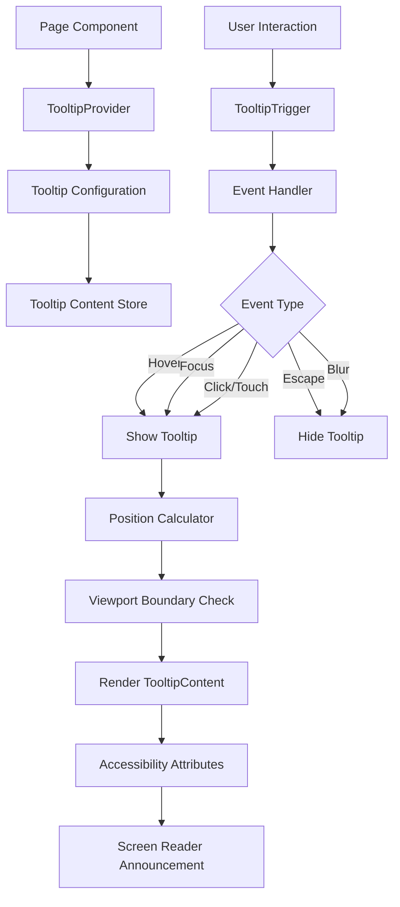

# Design Document: User Guidance and Tooltips

## Overview

This design document specifies the implementation of a comprehensive tooltip system for the AURA Customer Churn Prevention System. The system will provide contextual help through info icons and tooltips that explain technical ML concepts, risk scores, SHAP values, and campaign recommendations in clear Turkish language.

### Goals

- Make technical ML concepts accessible to non-technical users (telecom employees and competition judges)
- Provide contextual explanations without disrupting user workflow
- Ensure accessibility compliance (WCAG 2.1 AA)
- Maintain high performance with instant tooltip display
- Support both desktop and mobile interactions

### Technology Stack

- **Frontend Framework**: Next.js 16 with React 19
- **Language**: TypeScript
- **Styling**: Tailwind CSS 4
- **Icons**: Lucide React (for info icons)
- **Animation**: Framer Motion (for smooth transitions)
- **State Management**: Zustand (if needed for tooltip state)

### Design Principles

1. **Progressive Disclosure**: Show information only when needed
2. **Consistency**: Uniform tooltip appearance and behavior across all pages
3. **Accessibility First**: Keyboard navigation and screen reader support
4. **Performance**: No layout shifts, instant display
5. **Localization**: All content in Turkish with proper UTF-8 encoding

## Architecture

### Component Hierarchy

```
TooltipProvider (Context Provider)
├── TooltipTrigger (Info Icon)
└── TooltipContent (Popup)
```

### System Architecture



### Data Flow

1. **Initialization**: Page loads → TooltipProvider initializes → Tooltip configurations loaded
2. **Trigger**: User hovers/focuses info icon → Event captured → Tooltip ID identified
3. **Display**: Content retrieved → Position calculated → Tooltip rendered with animation
4. **Dismissal**: User moves away/presses Escape → Tooltip hidden with animation

## Components and Interfaces

### 1. TooltipProvider Component

**Purpose**: Provides tooltip context and manages global tooltip state.

**Props**:
```typescript
interface TooltipProviderProps {
  children: React.ReactNode;
  delayDuration?: number; // Default: 200ms
  skipDelayDuration?: number; // Default: 300ms
}
```

**Responsibilities**:
- Manage tooltip visibility state
- Handle tooltip positioning logic
- Provide tooltip context to child components
- Manage focus trap for accessibility

### 2. Tooltip Component

**Purpose**: Wrapper component that combines trigger and content.

**Props**:
```typescript
interface TooltipProps {
  id: string; // Unique identifier for tooltip content lookup
  children: React.ReactNode; // Trigger element (info icon)
  side?: 'top' | 'right' | 'bottom' | 'left'; // Default: 'top'
  align?: 'start' | 'center' | 'end'; // Default: 'center'
  delayDuration?: number; // Override provider delay
}
```

**Example Usage**:
```tsx
<Tooltip id="risk-score-explanation" side="right">
  <InfoIcon className="w-4 h-4 text-gray-400" />
</Tooltip>
```

### 3. TooltipTrigger Component

**Purpose**: Info icon that triggers tooltip display.

**Props**:
```typescript
interface TooltipTriggerProps {
  tooltipId: string;
  className?: string;
  ariaLabel?: string;
}
```

**Behavior**:
- Displays info icon (ℹ️) using Lucide React's `Info` component
- Handles mouse hover events (mouseenter, mouseleave)
- Handles keyboard focus events (focus, blur)
- Handles touch events for mobile (touchstart)
- Minimum touch target: 44x44px
- Visible focus indicator for keyboard navigation

**Accessibility Attributes**:
```typescript
{
  'role': 'button',
  'aria-label': 'Daha fazla bilgi',
  'aria-describedby': tooltipId,
  'aria-expanded': isOpen,
  'tabIndex': 0
}
```

### 4. TooltipContent Component

**Purpose**: Displays the tooltip popup with content.

**Props**:
```typescript
interface TooltipContentProps {
  id: string;
  content: string | React.ReactNode;
  position: { x: number; y: number };
  side: 'top' | 'right' | 'bottom' | 'left';
  align: 'start' | 'center' | 'end';
}
```

**Styling**:
- Max width: 300px
- Font size: 14px
- Padding: 12px 16px
- Background: rgba(23, 43, 77, 0.95) with backdrop blur
- Text color: white
- Border radius: 8px
- Box shadow: 0 4px 12px rgba(0, 0, 0, 0.15)
- Arrow pointer: 8px triangle pointing to trigger

**Animation**:
- Entry: Fade in + scale from 0.95 to 1.0 (150ms ease-out)
- Exit: Fade out + scale to 0.95 (100ms ease-in)
- Use Framer Motion for smooth animations

**Accessibility Attributes**:
```typescript
{
  'role': 'tooltip',
  'id': tooltipId,
  'aria-hidden': !isOpen
}
```

### 5. TooltipContentStore

**Purpose**: Centralized storage for all tooltip content.

**Structure**:
```typescript
interface TooltipContent {
  id: string;
  title?: string;
  content: string;
  category: 'risk' | 'shap' | 'campaign' | 'metric' | 'field';
}

interface TooltipContentStore {
  tooltips: Record<string, TooltipContent>;
  getContent: (id: string) => TooltipContent | undefined;
  setContent: (id: string, content: TooltipContent) => void;
}
```

**Implementation**: Use a TypeScript module with exported constant object.

**Example Content**:
```typescript
export const tooltipContent: Record<string, TooltipContent> = {
  'risk-score': {
    id: 'risk-score',
    title: 'Risk Skoru',
    content: 'Risk skoru 0-100 arasında bir değerdir. Yüksek değerler müşterinin hizmeti bırakma olasılığının daha yüksek olduğunu gösterir. Skor, müşteri süresi, aylık ücret, sözleşme tipi gibi faktörler kullanılarak XGBoost makine öğrenmesi modeliyle hesaplanır.',
    category: 'risk'
  },
  'shap-values': {
    id: 'shap-values',
    title: 'SHAP Değerleri',
    content: 'SHAP değerleri, her faktörün risk skorunu ne kadar artırdığını veya azalttığını gösterir. Pozitif değerler (+) riski artıran faktörlerdir, negatif değerler (-) riski azaltan faktörlerdir. Örneğin: "Aylık sözleşme: +15" bu faktörün riski 15 puan artırdığı anlamına gelir.',
    category: 'shap'
  },
  'campaign-recommendation': {
    id: 'campaign-recommendation',
    title: 'Kampanya Önerisi',
    content: 'Kampanya önerileri, müşterinin risk faktörlerine göre otomatik olarak oluşturulur. Her öneri, müşterinin kayıp olasılığını azaltmak için özel olarak tasarlanmıştır ve beklenen etki yüzdesi ile birlikte sunulur.',
    category: 'campaign'
  },
  'churn-rate': {
    id: 'churn-rate',
    title: 'Kayıp Oranı',
    content: 'Kayıp oranı (churn rate), belirli bir dönemde hizmeti bırakan müşterilerin toplam müşteri sayısına oranıdır. Örneğin %5 kayıp oranı, her 100 müşteriden 5\'inin hizmeti bıraktığı anlamına gelir.',
    category: 'metric'
  },
  'retention-rate': {
    id: 'retention-rate',
    title: 'Elde Tutma Oranı',
    content: 'Elde tutma oranı (retention rate), belirli bir dönemde hizmete devam eden müşterilerin yüzdesidir. %95 elde tutma oranı, müşterilerin %95\'inin hizmete devam ettiği anlamına gelir.',
    category: 'metric'
  },
  'roi': {
    id: 'roi',
    title: 'Yatırım Getirisi (ROI)',
    content: 'ROI, kampanya maliyetlerine göre elde edilen finansal getiriyi gösterir. Pozitif ROI kampanyanın karlı olduğunu, negatif ROI ise zarar ettiğini gösterir. Hesaplama: (Kazanılan Gelir - Kampanya Maliyeti) / Kampanya Maliyeti × 100',
    category: 'metric'
  },
  'tenure': {
    id: 'tenure',
    title: 'Müşteri Süresi',
    content: 'Müşterinin hizmeti kullandığı toplam ay sayısı. Uzun süreli müşteriler genellikle daha düşük kayıp riskine sahiptir.',
    category: 'field'
  },
  'contract-type': {
    id: 'contract-type',
    title: 'Sözleşme Tipi',
    content: 'Müşterinin sözleşme türü: Aylık (en yüksek risk), 1 Yıllık (orta risk), veya 2 Yıllık (en düşük risk). Uzun süreli sözleşmeler müşteri bağlılığını artırır.',
    category: 'field'
  },
  'monthly-charges': {
    id: 'monthly-charges',
    title: 'Aylık Ücret',
    content: 'Müşterinin aylık ödediği toplam tutar. Yüksek ücretler kayıp riskini artırabilir, özellikle değer algısı düşükse.',
    category: 'field'
  },
  'payment-method': {
    id: 'payment-method',
    title: 'Ödeme Yöntemi',
    content: 'Müşterinin fatura ödeme şekli. Otomatik ödeme yöntemleri (banka transferi, kredi kartı) daha düşük kayıp riski ile ilişkilidir.',
    category: 'field'
  }
};
```

### 6. Position Calculator Utility

**Purpose**: Calculate optimal tooltip position to avoid viewport overflow.

**Function Signature**:
```typescript
interface Position {
  x: number;
  y: number;
  side: 'top' | 'right' | 'bottom' | 'left';
}

function calculateTooltipPosition(
  triggerElement: HTMLElement,
  tooltipElement: HTMLElement,
  preferredSide: 'top' | 'right' | 'bottom' | 'left',
  align: 'start' | 'center' | 'end'
): Position;
```

**Algorithm**:
1. Get trigger element bounding rect
2. Get tooltip dimensions
3. Calculate initial position based on preferred side and alignment
4. Check viewport boundaries (window.innerWidth, window.innerHeight)
5. If overflow detected, try alternative sides in order: opposite → adjacent sides
6. Apply 8px offset from trigger element
7. Ensure 8px minimum distance from viewport edges
8. Return final position and actual side used

### 7. useTooltip Hook

**Purpose**: Custom React hook for tooltip functionality.

**Interface**:
```typescript
interface UseTooltipReturn {
  isOpen: boolean;
  open: () => void;
  close: () => void;
  toggle: () => void;
  triggerRef: React.RefObject<HTMLElement>;
  contentRef: React.RefObject<HTMLElement>;
  position: Position | null;
}

function useTooltip(
  tooltipId: string,
  options?: {
    delayDuration?: number;
    side?: 'top' | 'right' | 'bottom' | 'left';
    align?: 'start' | 'center' | 'end';
  }
): UseTooltipReturn;
```

**Behavior**:
- Manages tooltip open/close state
- Handles hover delay (200ms default)
- Calculates position when opened
- Provides refs for trigger and content elements
- Cleans up event listeners on unmount

## Data Models

### TooltipState

```typescript
interface TooltipState {
  openTooltipId: string | null;
  position: Position | null;
  isHovering: boolean;
  isFocused: boolean;
}
```

### TooltipConfig

```typescript
interface TooltipConfig {
  delayDuration: number; // Hover delay before showing (ms)
  skipDelayDuration: number; // Delay when moving between tooltips (ms)
  maxWidth: number; // Maximum tooltip width (px)
  offset: number; // Distance from trigger (px)
  arrowSize: number; // Arrow pointer size (px)
  animationDuration: number; // Animation duration (ms)
}

const defaultTooltipConfig: TooltipConfig = {
  delayDuration: 200,
  skipDelayDuration: 300,
  maxWidth: 300,
  offset: 8,
  arrowSize: 8,
  animationDuration: 150
};
```

### TooltipEvent

```typescript
type TooltipEventType = 
  | 'hover_enter'
  | 'hover_leave'
  | 'focus'
  | 'blur'
  | 'click'
  | 'touch'
  | 'escape';

interface TooltipEvent {
  type: TooltipEventType;
  tooltipId: string;
  timestamp: number;
  triggerElement: HTMLElement;
}
```

### Page-Specific Tooltip Mappings

Each page will have a mapping of UI elements to tooltip IDs:

```typescript
// Dashboard Page
const dashboardTooltips = {
  riskDistribution: 'risk-distribution',
  churnRate: 'churn-rate',
  totalCustomers: 'total-customers',
  highRiskCount: 'high-risk-count',
  monthlyRevenue: 'monthly-revenue'
};

// Customer Detail Page
const customerDetailTooltips = {
  riskScore: 'risk-score',
  shapValues: 'shap-values',
  aiInsights: 'ai-insights',
  campaignRecommendations: 'campaign-recommendation'
};

// Risk Calculator Page
const calculatorTooltips = {
  tenure: 'tenure',
  contractType: 'contract-type',
  monthlyCharges: 'monthly-charges',
  paymentMethod: 'payment-method',
  phoneService: 'phone-service',
  internetService: 'internet-service',
  resultRiskScore: 'risk-score',
  resultShapAnalysis: 'shap-values'
};

// ROI Simulation Page
const simulationTooltips = {
  roi: 'roi',
  retentionRate: 'retention-rate',
  projectedRevenue: 'projected-revenue',
  campaignCost: 'campaign-cost',
  customerLifetimeValue: 'customer-lifetime-value'
};
```


## Correctness Properties

*A property is a characteristic or behavior that should hold true across all valid executions of a system—essentially, a formal statement about what the system should do. Properties serve as the bridge between human-readable specifications and machine-verifiable correctness guarantees.*

### Property 1: Info Icon Consistency

*For any* page in the application, all info icons should use the same component (Lucide React's Info component) with consistent styling and positioning relative to their associated elements.

**Validates: Requirements 1.5, 1.6**

### Property 2: Tooltip Display Timing

*For any* info icon, when a hover event occurs, the associated tooltip should appear within 200ms, and when the mouse leaves, the tooltip should disappear within 200ms.

**Validates: Requirements 2.1, 2.2, 12.2**

### Property 3: Viewport Boundary Handling

*For any* tooltip trigger positioned anywhere on the page (including near viewport edges and on mobile devices), the displayed tooltip should remain fully visible within the viewport boundaries without overflow.

**Validates: Requirements 2.4, 11.4**

### Property 4: Single Tooltip Display

*For any* sequence of tooltip trigger events, only one tooltip should be visible at any given time.

**Validates: Requirements 2.5**

### Property 5: No Layout Shift

*For any* tooltip display or hide event, the Cumulative Layout Shift (CLS) metric should remain at 0, indicating no page layout shifts occurred.

**Validates: Requirements 12.3**

### Property 6: Turkish Language Content

*For any* tooltip in the content store, the content text should be in Turkish language (containing Turkish characters and Turkish words, not English).

**Validates: Requirements 3.4, 4.4, 5.4, 6.5**

### Property 7: UTF-8 Encoding Support

*For any* tooltip content containing Turkish characters (ğ, ü, ş, ı, ö, ç, Ğ, Ü, Ş, İ, Ö, Ç), the characters should render correctly without encoding errors.

**Validates: Requirements 9.2**

### Property 8: Metric Tooltip Structure

*For any* tooltip in the "metric" category, the content should include three elements: definition, calculation method, and business significance.

**Validates: Requirements 6.1**

### Property 9: Keyboard Navigation

*For any* info icon, pressing Tab should move focus to it, pressing Enter or Space when focused should display the tooltip, and pressing Escape when tooltip is visible should hide it and return focus to the icon.

**Validates: Requirements 7.1, 7.2, 7.3, 7.4**

### Property 10: Focus Indicator Visibility

*For any* info icon, when it receives keyboard focus, a visible focus indicator (outline or ring) should be present with sufficient contrast.

**Validates: Requirements 7.5**

### Property 11: Accessibility Attributes

*For any* info icon, it should have appropriate ARIA attributes (role="button", aria-label, aria-describedby, aria-expanded) and the associated tooltip should have role="tooltip" and be included in the accessibility tree when visible.

**Validates: Requirements 8.1, 8.2, 8.3, 8.4, 8.5**

### Property 12: Touch Target Size

*For any* info icon on a touch device, the touch target size should be at least 44x44 pixels.

**Validates: Requirements 11.5**

### Property 13: Touch Interaction

*For any* info icon on a touch device, tapping it should display the tooltip, and tapping outside the tooltip area should hide it.

**Validates: Requirements 11.1, 11.2**

### Property 14: Close Button on Mobile

*For any* tooltip displayed on a touch device, a close button should be present within the tooltip for explicit dismissal.

**Validates: Requirements 11.3**

### Property 15: Style Consistency

*For any* tooltip, it should have consistent styling: minimum 4.5:1 contrast ratio, 14px minimum font size, 300px maximum width, and consistent padding/border/background.

**Validates: Requirements 10.1, 10.2, 10.3, 10.4**

### Property 16: Multi-Paragraph Formatting

*For any* tooltip containing multiple paragraphs or lists, appropriate spacing (margin or padding) should be applied between elements.

**Validates: Requirements 10.5**

### Property 17: DOM Element Reuse

*For any* sequence of tooltip displays, the tooltip system should reuse existing DOM elements rather than creating new ones for each display, keeping the DOM node count stable.

**Validates: Requirements 12.4**

### Property 18: Hover Debouncing

*For any* rapid sequence of hover events on the same or different info icons, the tooltip system should debounce the display to prevent flickering, showing only the final intended tooltip.

**Validates: Requirements 12.5**

## Error Handling

### Missing Tooltip Content

**Scenario**: A tooltip ID is referenced but no content exists in the content store.

**Handling**:
1. Log a warning to console: `[Tooltip Warning] No content found for tooltip ID: ${tooltipId}`
2. Display a fallback tooltip with generic text: "Bilgi mevcut değil" (Information not available)
3. Apply a distinct visual style (yellow border) to indicate missing content
4. Do not crash or prevent the info icon from rendering

**Implementation**:
```typescript
function getTooltipContent(id: string): TooltipContent {
  const content = tooltipContent[id];
  
  if (!content) {
    console.warn(`[Tooltip Warning] No content found for tooltip ID: ${id}`);
    return {
      id,
      title: 'Bilgi Eksik',
      content: 'Bu alan için açıklama henüz eklenmemiş.',
      category: 'field'
    };
  }
  
  return content;
}
```

### Positioning Failure

**Scenario**: Tooltip cannot be positioned within viewport boundaries on any side.

**Handling**:
1. Position tooltip at the center of the viewport
2. Add scrollable content if tooltip height exceeds viewport height
3. Ensure close button is always visible
4. Log a warning about positioning constraint

### Animation Performance Issues

**Scenario**: Device has reduced motion preference or low performance.

**Handling**:
1. Detect `prefers-reduced-motion` media query
2. Disable animations if preference is set
3. Use instant show/hide instead of fade transitions
4. Maintain all functionality without animations

**Implementation**:
```typescript
const prefersReducedMotion = window.matchMedia('(prefers-reduced-motion: reduce)').matches;

const animationConfig = prefersReducedMotion ? {
  initial: { opacity: 1 },
  animate: { opacity: 1 },
  exit: { opacity: 0 },
  transition: { duration: 0 }
} : {
  initial: { opacity: 0, scale: 0.95 },
  animate: { opacity: 1, scale: 1 },
  exit: { opacity: 0, scale: 0.95 },
  transition: { duration: 0.15 }
};
```

### Touch Device Detection Failure

**Scenario**: Touch device detection is unreliable or fails.

**Handling**:
1. Use progressive enhancement: assume touch support by default
2. Add both hover and touch event listeners
3. Include close button on all tooltips (hidden on desktop via CSS)
4. Ensure minimum touch target size on all devices

### Accessibility Tree Issues

**Scenario**: Tooltip content is not announced by screen readers.

**Handling**:
1. Ensure tooltip has `role="tooltip"` attribute
2. Connect tooltip to trigger via `aria-describedby`
3. Use `aria-live="polite"` for dynamic content updates
4. Test with multiple screen readers (NVDA, JAWS, VoiceOver)
5. Provide alternative text via `aria-label` if content is complex

### Content Encoding Errors

**Scenario**: Turkish characters display as garbled text.

**Handling**:
1. Ensure all files use UTF-8 encoding
2. Set HTML meta charset: `<meta charset="UTF-8">`
3. Validate content store file encoding
4. Add encoding tests to CI/CD pipeline

## Testing Strategy

### Dual Testing Approach

This feature requires both unit tests and property-based tests for comprehensive coverage:

- **Unit tests**: Verify specific examples, edge cases, and error conditions
- **Property tests**: Verify universal properties across all inputs
- Both approaches are complementary and necessary

### Unit Testing

Unit tests should focus on:

1. **Specific Page Examples**:
   - Dashboard page has info icons next to risk distribution, churn rate, total customers
   - Customer detail page has info icons next to risk score, SHAP values, AI insights
   - Calculator page has info icons next to all input fields
   - ROI simulation page has info icons next to ROI metrics

2. **Specific Content Examples**:
   - Risk score tooltip contains explanation of 0-100 range
   - SHAP values tooltip contains example with positive/negative values
   - Campaign recommendation tooltip contains expected outcomes
   - Churn rate tooltip explains percentage calculation

3. **Edge Cases**:
   - Missing tooltip content shows fallback message
   - Tooltip near viewport edge repositions correctly
   - Rapid hover events don't cause multiple tooltips
   - Empty content string handled gracefully

4. **Integration Points**:
   - Tooltip provider wraps page components correctly
   - Content store loads on application initialization
   - Position calculator integrates with DOM measurements
   - Animation library (Framer Motion) integrates correctly

5. **Error Conditions**:
   - Invalid tooltip ID logs warning
   - Positioning failure falls back to center
   - Animation performance issues disable animations
   - Encoding errors display error message

### Property-Based Testing

Property tests should focus on:

1. **Universal Behaviors** (Properties 1-18 from Correctness Properties section)
2. **Randomized Input Generation**:
   - Random tooltip IDs from content store
   - Random trigger positions (viewport edges, center, corners)
   - Random page contexts (dashboard, calculator, customer detail, simulation)
   - Random interaction sequences (hover, focus, click, escape)

3. **Test Configuration**:
   - Minimum 100 iterations per property test
   - Each test tagged with: `Feature: user-guidance-tooltips, Property {N}: {description}`

4. **Property Test Examples**:

```typescript
// Property 2: Tooltip Display Timing
test('Feature: user-guidance-tooltips, Property 2: Tooltip display timing', async () => {
  await fc.assert(
    fc.asyncProperty(
      fc.constantFrom(...Object.keys(tooltipContent)), // Random tooltip ID
      async (tooltipId) => {
        const trigger = screen.getByTestId(`tooltip-trigger-${tooltipId}`);
        const startTime = performance.now();
        
        fireEvent.mouseEnter(trigger);
        await waitFor(() => screen.getByRole('tooltip'));
        
        const displayTime = performance.now() - startTime;
        expect(displayTime).toBeLessThan(200);
        
        const hideStartTime = performance.now();
        fireEvent.mouseLeave(trigger);
        await waitFor(() => expect(screen.queryByRole('tooltip')).not.toBeInTheDocument());
        
        const hideTime = performance.now() - hideStartTime;
        expect(hideTime).toBeLessThan(200);
      }
    ),
    { numRuns: 100 }
  );
});

// Property 4: Single Tooltip Display
test('Feature: user-guidance-tooltips, Property 4: Single tooltip display', async () => {
  await fc.assert(
    fc.asyncProperty(
      fc.array(fc.constantFrom(...Object.keys(tooltipContent)), { minLength: 2, maxLength: 5 }),
      async (tooltipIds) => {
        // Trigger multiple tooltips in sequence
        for (const id of tooltipIds) {
          const trigger = screen.getByTestId(`tooltip-trigger-${id}`);
          fireEvent.mouseEnter(trigger);
          await waitFor(() => screen.getByRole('tooltip'));
          
          // Verify only one tooltip is visible
          const tooltips = screen.getAllByRole('tooltip');
          expect(tooltips).toHaveLength(1);
        }
      }
    ),
    { numRuns: 100 }
  );
});

// Property 6: Turkish Language Content
test('Feature: user-guidance-tooltips, Property 6: Turkish language content', () => {
  fc.assert(
    fc.property(
      fc.constantFrom(...Object.keys(tooltipContent)),
      (tooltipId) => {
        const content = tooltipContent[tooltipId];
        const turkishPattern = /[ğüşıöçĞÜŞİÖÇ]/;
        const englishOnlyPattern = /^[a-zA-Z0-9\s.,!?-]+$/;
        
        // Should contain Turkish characters OR not be English-only
        const hasTurkishChars = turkishPattern.test(content.content);
        const isEnglishOnly = englishOnlyPattern.test(content.content);
        
        expect(hasTurkishChars || !isEnglishOnly).toBe(true);
      }
    ),
    { numRuns: 100 }
  );
});

// Property 11: Accessibility Attributes
test('Feature: user-guidance-tooltips, Property 11: Accessibility attributes', () => {
  fc.assert(
    fc.property(
      fc.constantFrom(...Object.keys(tooltipContent)),
      (tooltipId) => {
        const trigger = screen.getByTestId(`tooltip-trigger-${tooltipId}`);
        
        // Check ARIA attributes
        expect(trigger).toHaveAttribute('role', 'button');
        expect(trigger).toHaveAttribute('aria-label');
        expect(trigger).toHaveAttribute('aria-describedby');
        expect(trigger).toHaveAttribute('aria-expanded');
        expect(trigger).toHaveAttribute('tabIndex', '0');
      }
    ),
    { numRuns: 100 }
  );
});
```

### Testing Tools

- **Unit Testing**: Jest + React Testing Library
- **Property-Based Testing**: fast-check library for TypeScript
- **Accessibility Testing**: jest-axe for automated a11y checks
- **Visual Regression**: Percy or Chromatic for tooltip appearance
- **Performance Testing**: Lighthouse CI for CLS and timing metrics

### Test Coverage Goals

- Unit test coverage: 90%+ for tooltip components
- Property test coverage: All 18 correctness properties
- Accessibility: 100% WCAG 2.1 AA compliance
- Performance: All tooltips display within 200ms
- Visual: All tooltip variations captured in visual regression tests
